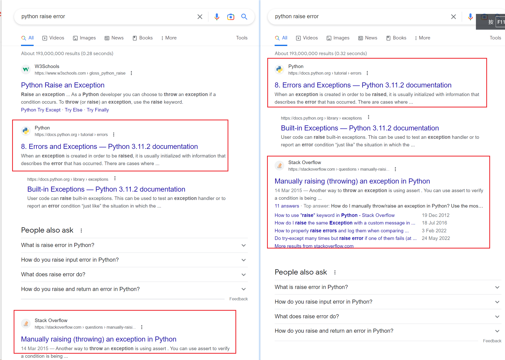

# priority-display-websites

油猴脚本，提交设置的网站在 Google 搜索的返回结果中的展示优先级。

## 调整需要提升优先级的网址

```js
//需要添加其他网站关键字，则按规则加入
var re = 'stackoverflow|github|quora|python\.org';
```

## 效果

下图左侧为正常 Google 排序，右侧为脚本提升指定网站展示优先级后的效果。



